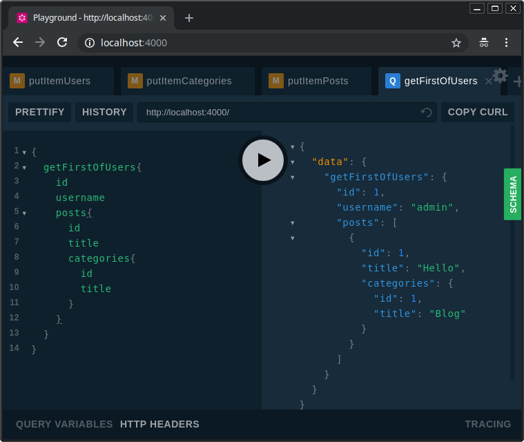

# db2graphql

Generates a Graphql schema and resolvers from an existing relational database

[](https://travis-ci.org/taviroquai/db2graphql)

## Features
* Fully compatible with **express**, **koa**, **hapi** and **Apollo Server**
* Converts an existing relational database (only PostgreSQL for now) schema to a JSON schema
* Generates a Graphql schema (string) with few but convenient types, queries and mutations
* Implements a generic Graphql resolver with a basic API for fast CRUD operations
* Eager loading of related records based on foreign keys
* Allows to add/override resolvers

## Demo
[](https://www.youtube.com/watch?v=HYwjcqekCuc)

### Query example
```gql
query{
  getFirstOfUsers(
    filter: "users:id=2"
    pagination: "posts:limit=10;orderby=title desc"
  ) {
    id
    username
    posts {
      id
      title
      categories {
        id
        title
      }
    }
  }
}
```

## Limitations/TODO
* Only PostgreSQL supported
* Better database types handling
* Better database queries optimization
* Create tests
* Create an NPM module
* Move to TypeScript
* Add more and improve convenient API methods. Currently, only:
    1. getPage
    1. getFirstOf
    1. putItem

## Usage

### Generate a Graphql schema from an existing relational database
```js
const knex = require('knex');
const db2g = require('../src/db2g');
const api = new db2g(knex(require('./connection.json')));
await api.connect();
const schema = api.getSchema();
```

### Complete example with Apollo Server
```js
const knex = require('knex');
const db2g = require('../src/db2g');
const { ApolloServer, gql } = require('apollo-server');

const start = async (cb) => {

  /**************************************/
  const api = new db2g(knex(require('./connection.json')));
  await api.connect(); // Connects to database and extracts database schema
  const schema = api.getSchema();
  const resolvers = api.getResolvers();
  /**************************************/

  // Create Apollo Server and start
  if (!schema) throw new Error('Error: empty schema');
  console.log(schema);
  const server = new ApolloServer({
    typeDefs: gql`${schema}`,
    resolvers,
  });
  server.listen().then(({ url }) => {
    console.log(`🚀 Server ready at ${url}`);
  });
}

start();
```

### Implement specific resolvers
```js
api.override('getFirstOf', async (root, args, context) => {
  const { resolver, tablename, db } = context.ioc;
  if (tablename === 'categories') return await db('categories').first();

   // You can still run the build-in resolver
  return resolver.getFirstOf(tablename, args);
});
```

### Example without database connection
```js
const db2g = require('../src/db2g');
const api = new db2g();

// Add a query and resolver
api.addQuery('getFoo: Boolean');
api.addResolver('Query', 'getFoo', async (root, args, context) => {
  return true;
});

// Ready to generate schema
const schema = api.getSchema();
const resolvers = api.getResolvers();
```

## Run de demo
```
$ git clone https://github.com/taviroquai/db2graphql.git
$ cd db2graphql
$ npm install
$ psql -h localhost -U postgres -c "CREATE DATABASE db2graphql"
$ cp connection.example.json connection.json
# Edit connection.json
$ npm run demo-db
$ npm run start
```

Open browser on http://localhost:4000 and see your Graphql API ready!

## Collab

Anyone is free to collab :)

## License
MIT, what else?


